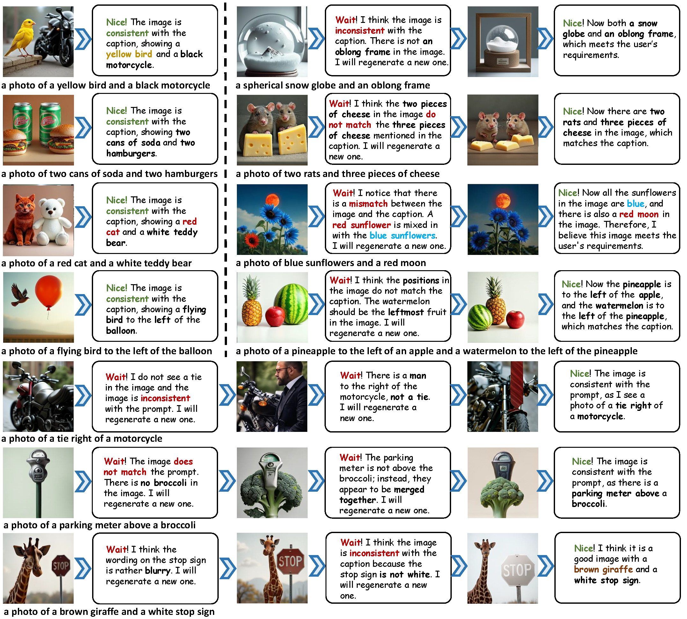

<h2 align="center" style="line-height: 25px;">
  
  Janus-Pro-R1: Advancing Collaborative Visual Comprehension and Generation
</h2>

<p align="center">
  <a href="https://arxiv.org/abs/2506.01480">
    
  </a>
  <a href="https://janus-pro-r1.github.io/">
    
  </a>
  <a href="https://github.com/wendell0218/Janus-Pro-R1">
    
  </a>
  <a href="https://huggingface.co/midbee/Janus-Pro-R1-7B">
    
  </a>
  <a href="https://huggingface.co/datasets/midbee/Janus-Pro-R1-Data">
    
  </a>
</p>

<div align="center">
Kaihang Pan<sup>1*</sup>, Yang Wu<sup>2*</sup>, Wendong Bu<sup>1*</sup>, Kai Shen<sup>1&ddagger;</sup>, Juncheng Li<sup>1&dagger;</sup>, Yingting Wang<sup>2</sup>, 
 
Yunfei Li<sup>2</sup>, Siliang Tang<sup>1</sup>, Jun Xiao<sup>1</sup>, Fei Wu<sup>1</sup>, Hang Zhao<sup>2</sup>, Yueting Zhuang<sup>1</sup>

<sup>1</sup>Zhejiang University, <sup>2</sup>Ant Group

\*Equal Contribution, <sup>&ddagger;</sup>Project Leader, <sup>&dagger;</sup>Corresponding Authors

</div>


## 🔥 News
- **[July 23, 2025]** We have released the [checkpoint](https://huggingface.co/midbee/Janus-Pro-R1-7B) and [training data](https://huggingface.co/datasets/midbee/Janus-Pro-R1-Data) of Janus-Pro-R1.
- **[June 18, 2025]** We have released the training and inference scripts of Janus-Pro-R1.
- **[June 2, 2025]** Our paper is now available on arXiv: [Unlocking Aha Moments via Reinforcement Learning: Advancing Collaborative Visual Comprehension and Generation](https://arxiv.org/abs/2506.01480).

## 📝 TODO
- [x] Release the paper
- [x] Release training scripts
- [x] Release inference scripts
- [x] Release training data
- [x] Release Janus-Pro-R1 checkpoint

## 🚀 Overview

We propose a **two-stage training paradigm** to enable introspective text-to-image generation via genuine reasoning chains (CoT), unlocking what we call **Aha Moments** in visual generation:

- **Stage 1 – Supervised Fine-Tuning (SFT):**  
  The model learns structured visual reasoning through three subtasks:
  - Text-to-image generation
  - Image-text consistency self-evaluation
  - Image regeneration through reflection

- **Stage 2 – Reinforcement Learning (RL):**  
  The model is trained using a token-level Markov decision process with bi-level QA-based rewards to encourage spontaneous reasoning and correction, optimizing via GRPO.

With self-reflective capabilities, this approach bridges the gap between text-to-image generation and image editing, enabling a unified and coherent visual reasoning process.


## ⚙️ Installation

**1. Prepare Environment**

We recommend using Python>=3.10 and setting up a virtual environment:

```bash
# clone our repo
git clone https://github.com/wendell0218/Janus-Pro-R1.git
cd Janus-Pro-R1

# prepare python environment for sft
conda create -n janus-pro-r1-sft python=3.11
conda activate janus-pro-r1-sft
pip install -r requirements-sft.txt

# prepare python environment for rl
conda create -n janus-pro-r1-rl python=3.11
conda activate janus-pro-r1-rl
pip install -r requirements-rl.txt
```

**2. Prepare Pretrained Model**

Janus-Pro-R1 utilizes `Janus-Pro-7B` as the pretrained model for subsequent supervised fine-tuning. You can download the corresponding model using the following command:
```bash
GIT_LFS_SKIP_SMUDGE=1 git clone https://huggingface.co/deepseek-ai/Janus-Pro-7B
cd Janus-Pro-7B
git lfs pull
```

## 🧪 Supervised Fine-Tuning (Stage 1)

The SFT training data for introspective text-to-image generation is released in [https://huggingface.co/datasets/midbee/Janus-Pro-R1-Data](https://huggingface.co/datasets/midbee/Janus-Pro-R1-Data).

You can perform SFT for **Text-to-Image Generation** using the following command:

```bash
cd janus-sft
python launch.py --args_yml_fn configs/t2i_generation.yml
```

Additionally, you can using the following command to SFT **Image Editing**:

```bash
cd janus-sft
python launch.py --args_yml_fn configs/image_editing.yml
```

For a more detailed introduction of the Supervised Fine-Tuning stage, please refer to [here](janus-sft/README.md).

## 🎯 Reinforcement Learning (Stage 2)

You can perform RL for **Text-to-Image Generation** using the following command:

```bash
cd janus-rl/src/open_r1

export ACCELERATE_CONFIG=../../recipes/accelerate_configs/zero2.yaml
export GRPO_CONFIG=../../recipes/t2i_generation/grpo.yml
export NUM_PROCESSES=8

accelerate launch \
  --config_file $ACCELERATE_CONFIG \
  --num_processes $NUM_PROCESSES \
  grpo_t2i.py \
  --config $GRPO_CONFIG
```

Additionally, you can use the following command for RL on **Image Editing**:

```bash
cd janus-rl/src/open_r1

export ACCELERATE_CONFIG=../../recipes/accelerate_configs/zero2.yaml
export GRPO_CONFIG=../../recipes/image_editing/grpo.yml
export NUM_PROCESSES=8

accelerate launch \
  --config_file $ACCELERATE_CONFIG \
  --num_processes $NUM_PROCESSES \
  grpo_editing.py \
  --config $GRPO_CONFIG
```

For a more detailed introduction of the Reinforcement Learning stage, please refer to [here](janus-rl/README.md).

## 🎨 Inference

We illustrate the inference process of introspective text-to-image generation under the simplest scenario, where the model performs a one-time image self-evaluation and image regeneration after the initial text-to-image generation.

First please prepare the model Janus-Pro-R1-7B, which utilizes Janus-Pro-7B as the backbone model. You can download the corresponding model from [🤗https://huggingface.co/midbee/Janus-Pro-R1-7B](https://huggingface.co/midbee/Janus-Pro-R1-7B).

You can conduct the inference process using the following command. ``model_path`` refers to the local path where you have downloaded Janus-Pro-R1-7B.


```bash
  python inference/inference.py \
      --model_path $CKPT_PATH \
      --caption "a brown giraffe and a white stop sign" \
      --gen_path "results/samples" \
      --reason_path "results/reason.jsonl" \
      --regen_path "results/regen_samples" \
      --cfg 5.0 \
      --parallel_size 4
  ```
After completing the inference, the structure of the `results` directory will be as follows:
  
  ```text
  results/
  ├── reason.jsonl
  ├── samples/
  │   ├── 0000.png
  │   ├── 0001.png
  │   ├── 0002.png
  │   └── 0003.png
  └── regen_samples/
      ├── 0000.png
      ├── 0001.png
      ├── 0002.png
      └── 0003.png
  ```

For a more detailed introduction for inference, please refer to [here](inference/README.md).

## 📊 Main Results

- ### Triggering Aha Moments
  

- ### Text-to-Image Generation
  

- ### Image Editing
  

## 🤝 Acknowledgment

Our project is developed based on the following repositories:

- [Janus-Series](https://github.com/deepseek-ai/Janus): Unified Multimodal Understanding and Generation Models
- [Open-R1](https://github.com/huggingface/open-r1): Fully open reproduction of DeepSeek-R1

## 📜 Citation

If you find this work useful for your research, please cite our paper and star our git repo:

```bibtex
@article{pan2025unlocking,
  title={Unlocking Aha Moments via Reinforcement Learning: Advancing Collaborative Visual Comprehension and Generation},
  author={Pan, Kaihang and Wu, Yang and Bu, Wendong and Shen, Kai and Li, Juncheng and Wang, Yingting and Li, Yunfei and Tang, Siliang and Xiao, Jun and Wu, Fei and others},
  journal={arXiv preprint arXiv:2506.01480},
  year={2025}
}

@article{pan2025focusdiff,
  title={FocusDiff: Advancing Fine-Grained Text-Image Alignment for Autoregressive Visual Generation through RL},
  author={Pan, Kaihang and Bu, Wendong and Wu, Yuruo and Wu, Yang and Shen, Kai and Li, Yunfei and Zhao, Hang and Li, Juncheng and Tang, Siliang and Zhuang, Yueting},
  journal={arXiv preprint arXiv:2506.05501},
  year={2025}
}
```